# 架构逻辑视图（sdk-service / db-service / http-client）

## 进程模型

运行时共 **3 个进程 + 1 个子线程**：

| 进程/线程 | 数量 | 角色 | 能力 |
|---|---|---|---|
| **Main（主进程）** | 1 | Node.js 环境，持有 C SDK/DB/网络 | 完整 Node API（fs/worker_threads/require）、Electron Main API（app/BrowserWindow/net/safeStorage） |
| **Renderer（渲染进程）** | 1 | Chromium 渲染引擎，跑 Vue 3 SPA | 纯浏览器环境，无 Node API（nodeIntegration=false），只通过 window.api.* 白名单 IPC 与主进程通信 |
| **Preload** | 1 | Renderer 进程的沙箱桥接 | 有受限 Node 权限（ipcRenderer/contextBridge），用 contextBridge.exposeInMainWorld 暴露白名单 API 给 Renderer |
| **Worker 线程** | 1 | 主进程内子线程（非独立进程） | 跑 Koffi FFI 调用 + C SDK 回调投递，避免阻塞主进程事件循环 |

```mermaid
graph TB
    subgraph "Electron 应用"
        subgraph "Main 进程"
            SDK[SdkClient]
            DB[DbClient]
            HTTP[HttpClient]
            REG[Register<br/>IPC handler]
            subgraph "Worker 线程"
                W[sdk.worker.ts<br/>Koffi FFI]
            end
        end

        subgraph "Preload"
            CB[contextBridge<br/>window.api.sdk/db/http]
        end

        subgraph "Renderer 进程"
            VUE[Vue 3 SPA<br/>UI + 交互]
        end
    end

    SDK --> W : invoke / on
    W --> SDK : MessagePort 回调
    REG --> SDK : 调用
    REG --> DB : 调用
    REG --> HTTP : 调用
    REG <-->|IPC ipcMain| CB : ipcRenderer.invoke
    CB --> VUE : window.api.* 暴露
```

- Main 进程与 Renderer 进程之间通过 **IPC**（`ipcMain.handle` ↔ `ipcRenderer.invoke`）通信
- Preload 运行在 Renderer 进程内，但通过 `contextIsolation` 沙箱隔离，只暴露白名单 API
- Worker 线程是 Main 进程的 `worker_threads`，通过 `MessagePort` 与 Main 通信，不是独立进程
- C SDK 指针、数据库连接、网络请求**只在 Main 进程**，Renderer 永远接触不到

---

## sdk-service

### 静态视图（类图 / 模块结构）

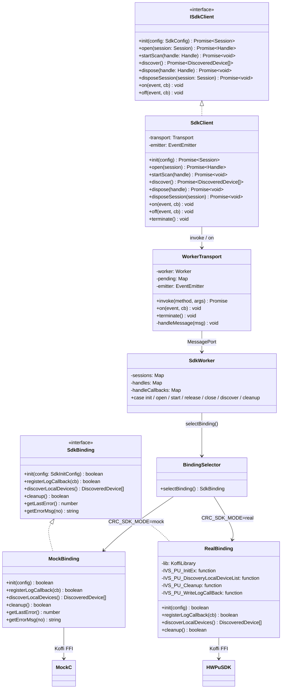

### 动态视图（时序图 — 二层搜索端到端）

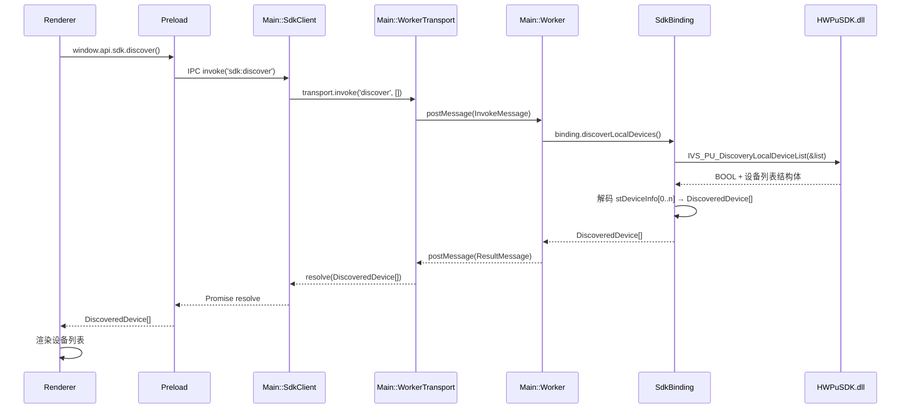

### 动态视图（时序图 — mock 扫描 + 异步回调）

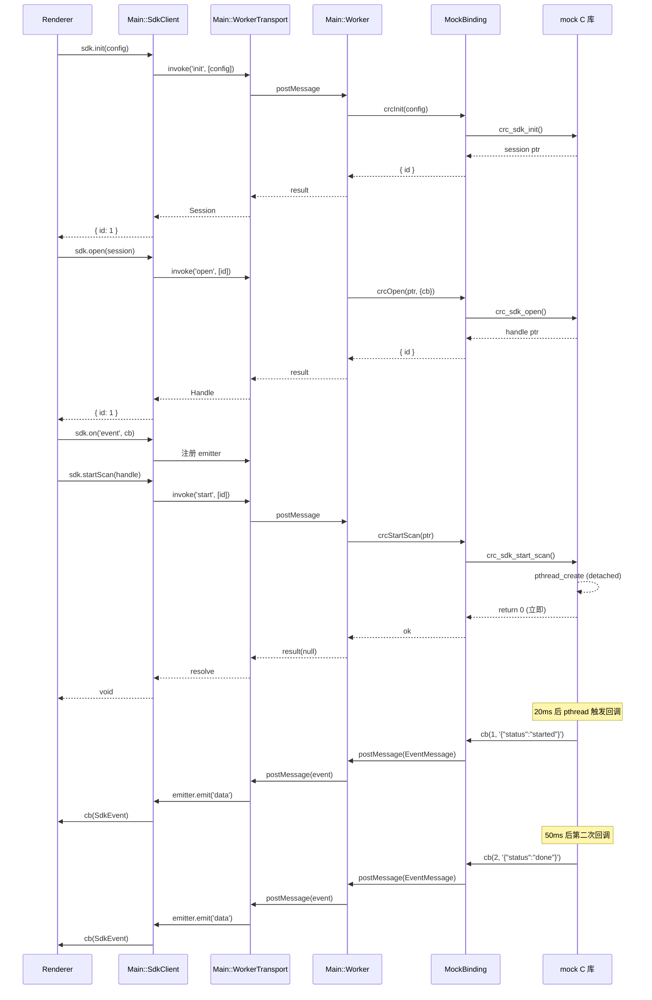

---

## db-service

### 静态视图（类图 / 模块结构）

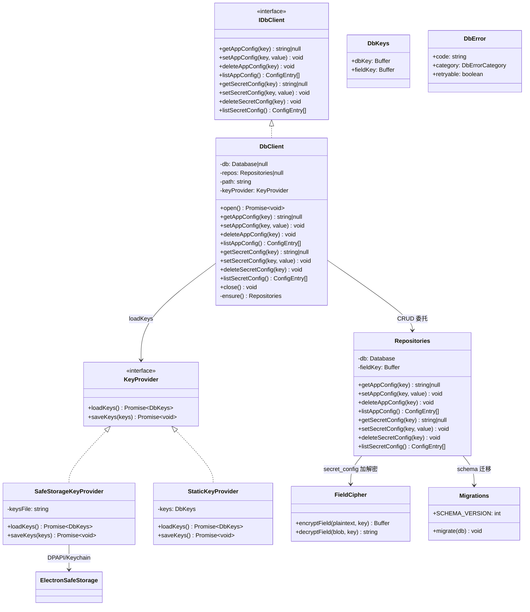

### 静态视图（ER 图 — 数据库表结构）

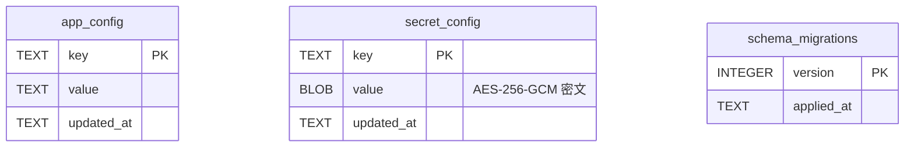

### 动态视图（时序图 — 加密库打开 + CRUD）

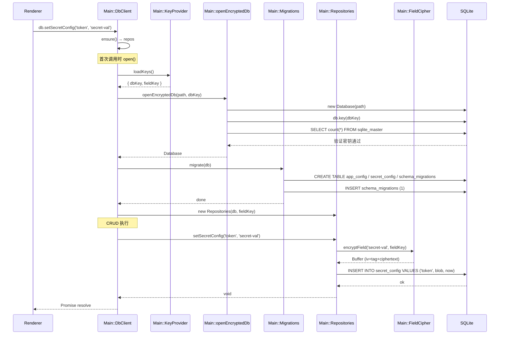

### 动态视图（时序图 — 密钥错误检测）

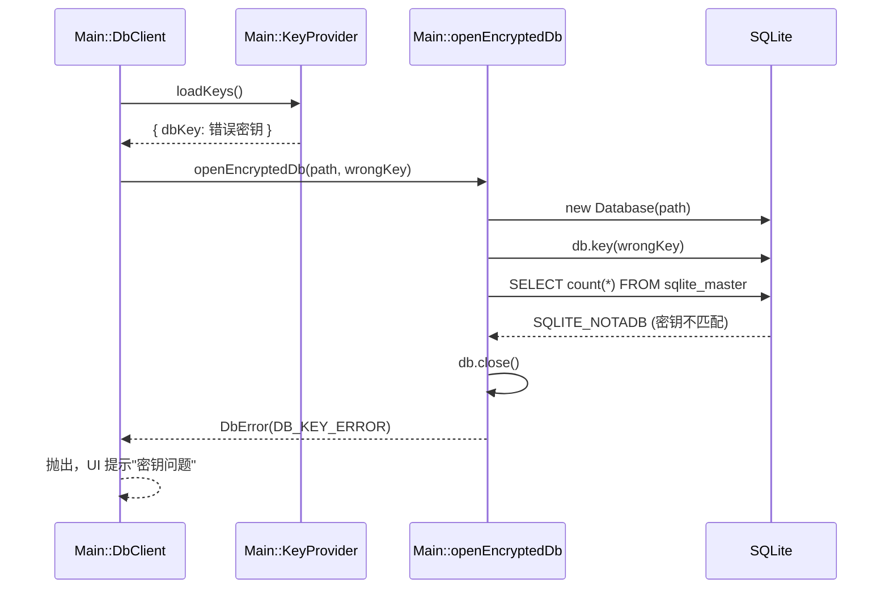

---

## http-client

### 静态视图（类图 / 模块结构）

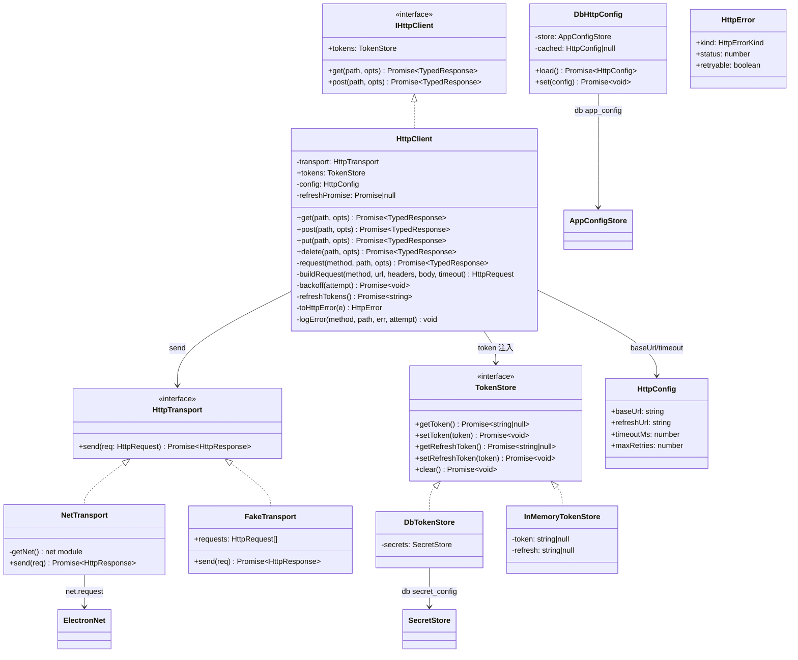

### 动态视图（时序图 — GET 请求 + 指数退避重试）

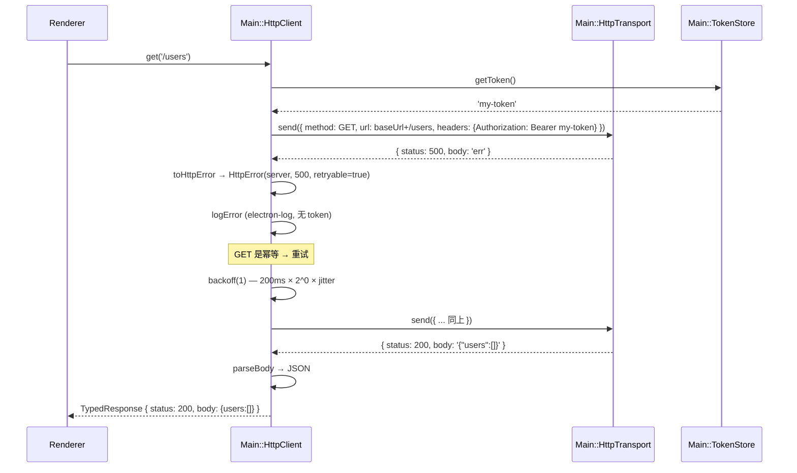

### 动态视图（时序图 — 401 刷新重放 + single-flight）

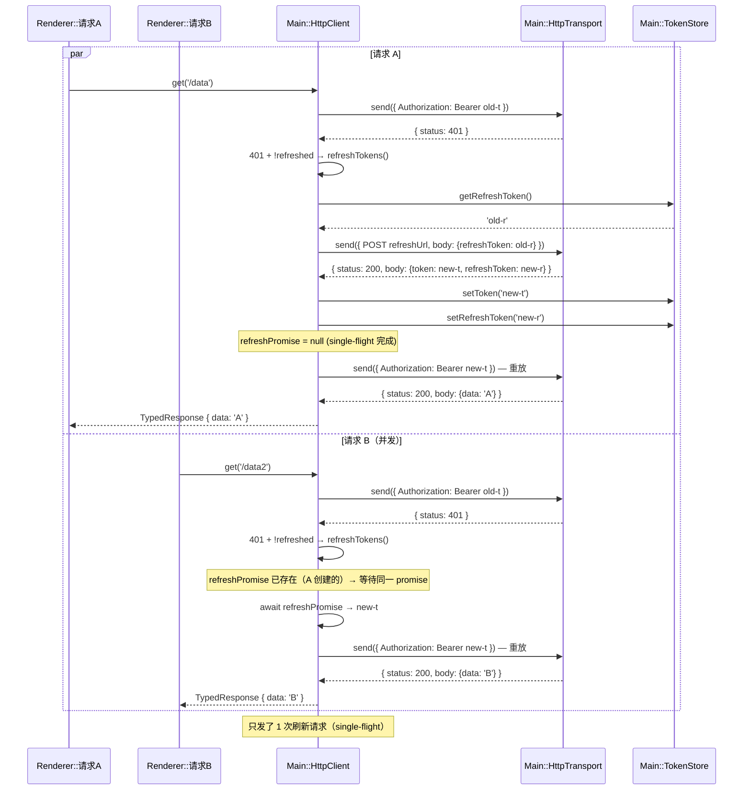

### 动态视图（时序图 — POST 不重试 + 错误传播）

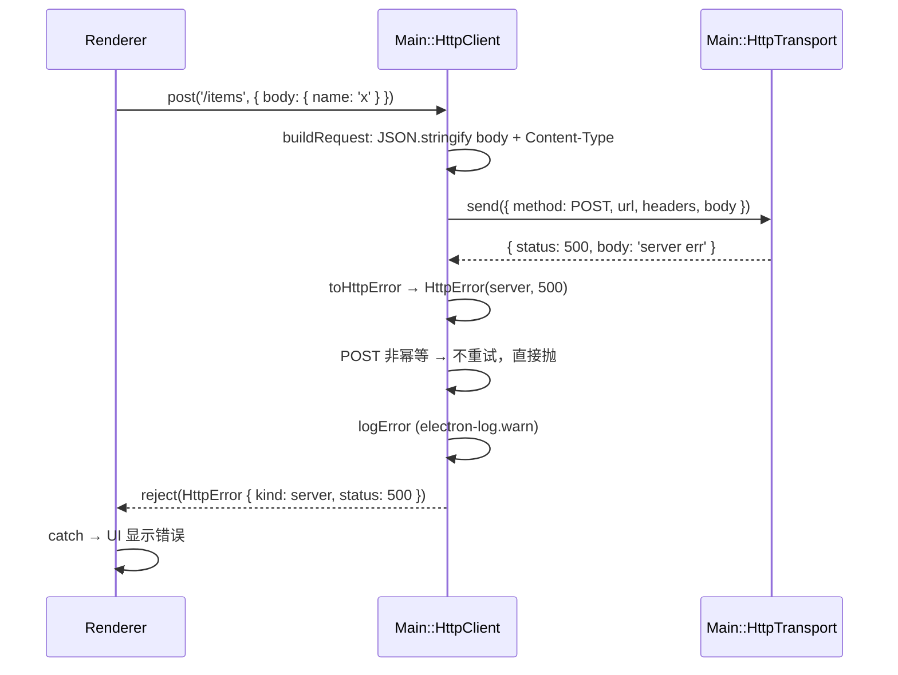

### 动态视图（时序图 — setConfig 重建实例）

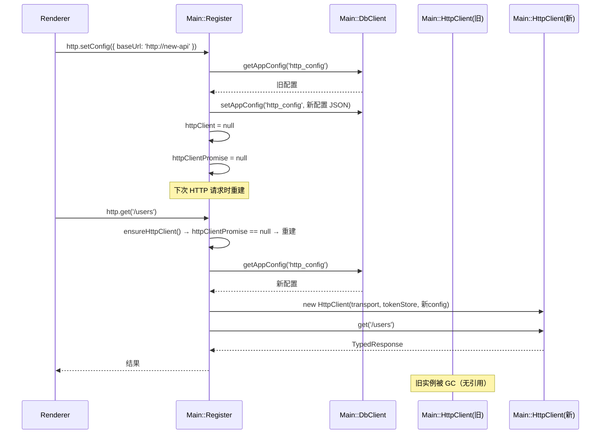
